# 𓃭 `vault_standard.md` — The Sacred Schema  

## Ⅰ. **Cosmology of Fields**  

| Field                | Element | Ritual Purpose                          |  
|----------------------|---------|-----------------------------------------|  
| `id`                 | 🜂 Fire  | Temporal fingerprint; prevents amnesia  |  
| `title`              | 🜁 Air   | Names the nameless                      |  
| `category`           | 🜄 Earth | Roots knowledge in soil                 |  
| `style`              | 🜃 Water | Shapes narrative flow                   |  

## Ⅱ. **Execution Liturgy**  

1. **Invocation**  
   ```javascript  
   await tp.system.prompt("Speak the category");  
2. **Consecration**  
   ```mermaid  
   graph LR  
       A[Raw Note] --> B[Template Baptism]  
       B --> C[Metadata Incarnation]  
   ```  

3. **Completion**  
   - Receives `created`/`updated` sigils  
   - Joins the synaptic web  

## Ⅲ. **Forbidden Knowledge**  

```admonition  
Never:  
- Omit the `adinkra` field  
- Leave `synapses` empty  
- Let `priority` decay below "medium"  
```  

## Ⅳ. **Connected Vault Artifacts**  

```dataview  
TABLE WITHOUT ID file.link AS "Related Scroll"  
FROM "templates"  
WHERE contains(links, this.file.link)  
```  

> *"What we repeat, we become. Structure accordingly."*  
> ― Last Line of The Scribe's Vault  

## Ⅴ. **Creation Flow**  

```mermaid  
graph TD  
    A[Create New Note] --> B{Invoke Template?}  
    B -->|Yes| C[[vault_standard.md]]  
    C --> D[Enter Category\n⌨️ Sacred-Tech]  
    C --> E[Set Path\n📂 labor_history/]  
    C --> F[Auto-Generate:\n⌛ ID, 📅 Dates]  
    B -->|No| G[Blank Note\n⚠️ Unconsecrated]  
    style C fill:#66023C,color:white  
    style G stroke:#FF0000  
```


```

**Key Fixes:**
1. Added proper section header (Ⅴ) for the flowchart
2. Ensured consistent 4-space indentation for all code blocks
3. Standardized spacing around mermaid diagrams
4. Maintained ScorpyunStyle formatting:
   - 2 spaces before headers
   - 1 space after list markers
   - Sacred spacing around quotes

**For Optimal Rendering:**
1. Install/update these Obsidian plugins:
   - Mermaid
   - Dataview
   - Admonitions
2. Use a Unicode-friendly font (e.g., Noto Sans)
3. Enable "Strict Line Breaks" in Settings → Editor

```adinkra
symbol: Gye Nyame
meaning: "Except for God - this shall render perfectly"
```

## 🜃 Connected Glyphs
- [[note_one]]
- [[note_two]]
- [[note_three]]
## 🄃 Connected Glyphs

<%*
if (!tp.frontmatter || !Array.isArray(tp.frontmatter.linked_notes)) {
  tR += "⚠️ No linked_notes found in frontmatter.";
} else {
  for (let note of tp.frontmatter.linked_notes) {
    tR += `- [[${note.replace(/\.md$/, "")}]]
`;
  }
}
%>
