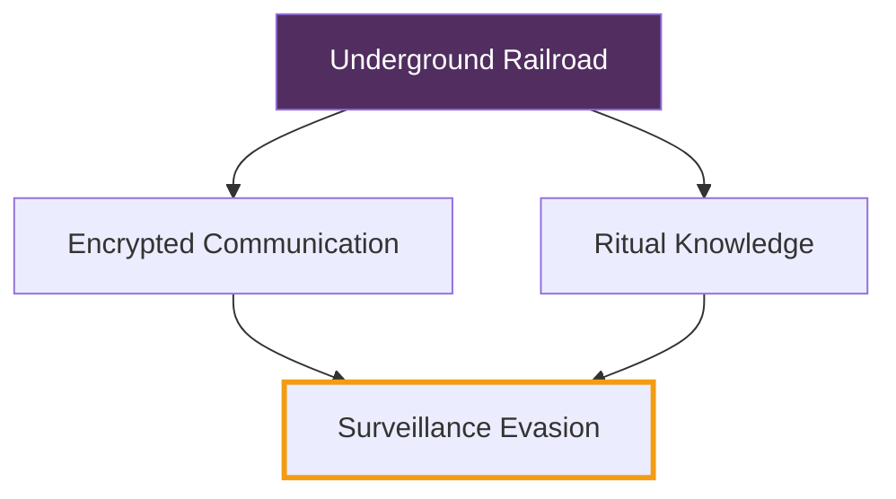

# 🕯️ From Underground to Underwatch

## Ⅰ. ✊🏾 Fugitive Optics: Tubman and the Surveillance State

Harriet Tubman didn’t just escape — she evaded the first generation of state-coordinated surveillance.  
The **slave patrols** of the 1800s were biometric by instinct: they knew Blackness as a target, not an identity.

- Lanterns. Hounds. Wanted posters. These were analog signals of a pre-digital surveillance regime.
- Tubman operated as a counter-algorithm — ghosting pattern recognition through forest trails and silence rituals.

> “I freed a thousand slaves. I could have freed a thousand more if only they knew they were slaves.”  
> — *Attributed to Tubman, disputed but spiritually accurate*

---

## Ⅱ. 🛰️ Racialized Surveillance Rebooted: 21st-Century Underwatch

Today's surveillance no longer hunts Blackness in fields — it hunts in feeds.

| System | Description | Modern Relevance |
|--------|-------------|------------------|
| **Facial Recognition** | Trained on biased data, overpolices Black faces | NYPD, London Met, China’s Skynet |
| **Predictive Policing** | Anticipates crime based on location + racialized data | LAPD’s “Laser” system, ShotSpotter |
| **Social Media Monitoring** | Targets activist hashtags and Black resistance networks | FBI tracking Ferguson/BLM |

---

## Ⅲ. 🔒 From Fugitive Codes to Encrypted Glyphs

Tubman used quilt codes. We use **encryption**, **VPNs**, and **offline organizing**.

- Hashtag = Drum Signal  
- Tor Browser = North Star  
- Burner Account = Safe House  

---

## Ⅳ. 🧠 Critical Anchors

> “Surveillance is permanent violence.” — Simone Browne, _Dark Matters_  
> “To be surveilled is to be narratively overdetermined by power.” — Ruha Benjamin

**Key Works**

- _Dark Matters_ – Simone Browne
    
- _Race After Technology_ – Ruha Benjamin
    
- _The Black Shoals_ – Tiffany Lethabo King
    

---

## Ⅴ. 🔗 Connected Glyphs

- [[reading_journal/deep_research/black_identity_web|black_identity_web]]
    
- [[the_lion_of_anacostia_bias_detection]]
    
- [[technofeudal_bias_audit]]
    
- [[sankofa_spine]]
    
- [[biblical_theme_miner]]
    

---

## 🜃 Closing Glyph

The transition from **underground to underwatch** is not linear — it's recursive.  
Wherever Black bodies move toward liberation, surveillance mutates to meet them.  
But so too do our technologies of refusal — sacred, encrypted, and ancestral.

> _Underwatch is not just survival. It's ancestral tech with a pulse_

## 🜃 Connected Glyphs
- [[note_one]]
- [[note_two]]
- [[note_three]]
## 🄃 Connected Glyphs

<%*
if (!tp.frontmatter || !Array.isArray(tp.frontmatter.linked_notes)) {
  tR += "⚠️ No linked_notes found in frontmatter.";
} else {
  for (let note of tp.frontmatter.linked_notes) {
    tR += `- [[${note.replace(/\.md$/, "")}]]
`;
  }
}
%>
