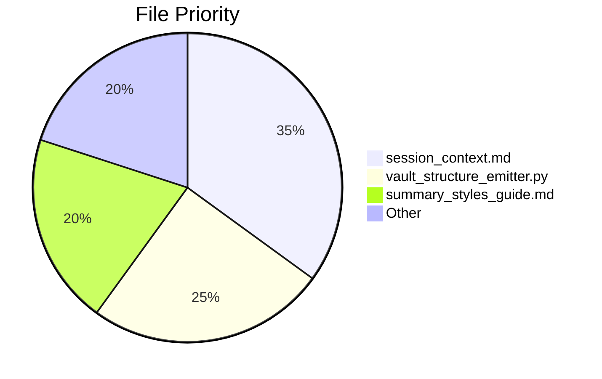

# 🏛️ ANACOSTIA VAULT PATH GLYPH

**Sacred-Tech Compliance:** `v3.2.1`  
**Last Validated:** `2025-05-16 18:40`

```mermaid
graph TD
    A[Anacostia Root] --> B[obsidian_fortress]
    A --> C[africana_studies]
    A --> D[ai_ethics]
    A --> E[projects/python_projects]
    A --> F[vault_ops]
    A --> G[critical_infrastructure]
    style A fill:#66023C,color:white
````

---

## 🌌 CORE PATH MATRIX

### 🔐 OBSIDIAN ROOT

𓃭 `C:/Users/digitalscorpyun/sankofa_temple/Anacostia`

---

### 🧿 KNOWLEDGE DOMAINS

```mermaid
flowchart LR
    subgraph "Thematic Clusters"
        A[obsidian_fortress] --> B[Agents]
        A --> C[Configs]
        A --> D[GriotBox]
        E[africana_studies] --> F[History]
        E --> G[Neo-Partition]
        H[ai_ethics] --> I[Case Studies]
        J[critical_infrastructure] --> K[GeoThreats]
    end
    style A stroke:#FFAA00
    style E stroke:#4CC9F0
    style J stroke:#E63946
```

|Domain|Key Subpaths|Sigil|
|---|---|---|
|`obsidian_fortress/`|Agents, Configs, Core Logic|🔱|
|`africana_studies/`|History, Resistance Movements|🌍|
|`ai_ethics/`|Fairness Audits, Case Studies|⚖️|
|`vault_ops/`|Scripts, Maintenance Rituals|⚙️|
|`critical_infrastructure/`|Defense Mapping, AI Geopolitics|🛰️|

---

## 📜 SACRED PATH CATALOG

### 🏛️ STRUCTURAL PILLARS

```
📂 obsidian_fortress/
├─ agent_registry.md
├─ configs/
│  ├─ grok_ctx_activation_prompt.md
│  └─ avm_config_yaml_example.md

📂 africana_studies/
├─ neo_partition_africa.md
├─ history/
│  └─ congo_free_state.md

📂 critical_infrastructure/
├─ china_civil_fusion.md
├─ dataview_ai_defense_dashboard.md
├─ mermaid_military_mappings.md
```

---

### ⚡ CRITICAL FILES



---

## 🌉 EXTERNAL CODEX

```
+ C:/Users/digitalscorpyun/projects_2025/avm_archivist
# All sacred automation scripts live here.
```

---

## 🔮 PATH INTEGRITY RITUALS

**PowerShell Vault Path Validation**

```powershell
./vault_ops/path_sanitizer.ps1 --validate
```

**Python Ritual**

```python
# Daily vault check
if path_doctrine_violation:
    invoke_repair_ritual()
```

**Progress Tracker**  
🔵 YAML frontmatter audits → **78% complete**  
🟣 Link validation → **in progress (v2.0.4)**

---

## 🜃 Connected Glyphs

- [[sankofa_spine.md]]
    
- [[session_context.md]]
    
- [[vault_structure_emitter]]
    
- [[war_council.md]]
    

---

> _"A vault’s strength flows through its paths like blood through veins."_  
> — Mnemonic Warden, _Law of Spatial Memory_

**Adinkra**: `🦢 Sankofa`  
**Meaning**: _Protection of sacred boundaries, memory recovered, paths reinforced._

---
### Connected Glyphs

- [[sankofa_spine]]
- [[session_context]]
- [[war_council]]
- [[vault_structure_emitter.py]]

