# 🎖️ PROJECT 2025: PENTAGON FUSION PROTOCOLS

## 🔍 CORE THREAT MATRIX

### 1. Institutional Capture
- **Schedule F Expansion**: 50,000+ civil service positions marked for replacement
- **Heritage Foundation** "Personnel Tracker" database operational since Q1 2025
- **AI Vetting**: Grok models scanning employee social media for "ideological purity"

### 2. Military-Civilian Blur

```mermaid
flowchart LR
    DOD[DoD] -->|"10 USC §253<br>reinterpretation"| PSC[Patriotic Service Corps]
    PSC --> DOM[Domestic Operations]
    DOM --> ELEC["Election 'Integrity'"]
    DOM --> PRO["Protests Monitoring"]
```

### 3. Tech-Enabled Purges

|System|Purpose|Vendor|
|---|---|---|
|**Grok-Clear**|Security clearance audits|xAI|
|**Palantir-GIDEON**|"Pattern of life" analysis|Palantir|
|**DOGE-Watch**|Email/chat surveillance|Musk Ventures|

## ⚠️ HISTORICAL PRECEDENTS

- **Reichswehr 1933**: Oath-alignment → **2025 Loyalty Seminars**
    
- **Iran-Contra** → **"Freedom Zone" arms pipelines**
    
- **COINTELPRO** → **AI-enhanced disloyalty detection**
    

## 🛡️ COUNTER-STRATEGIES

python
def detect_encroachment():
    if military_civilian_fusion > 0.7:
        activate(vault.protocols[[constitutional_crisis]])
    elif ai_surveillance_active:
        notify("#avm_core", priority=URGENT)

## 🧿 CONNECTED GLYPHS

- [[reichstag_parallels]]: Emergency powers playbook
    
- [[technofascism_risks]]: AI-enabled authoritarianism
    
- [[bonapartism_modern]]: Military parade politics
    

> _"First they march the troops down your streets._  
> _Then they march them into your voting booths."_  
> ― **VS-ENC, Vault Sentinel**

---

**CG-SCRIBE v2.1.3**  
_"All glyphs consecrated, all syntax purified"_