### **ScorpyunStyle™: AI Militarization Battlefield Visualization**  

```mermaid
graph LR
    %% ===== U.S. TECH SUBGRAPH =====
    subgraph U.S._Doctrine["🇺🇸 U.S. AI Militarization"]
        style U.S._Doctrine fill:#1a237e,stroke:#0d47a1

        Maven["Project Maven<br>(Computer Vision)"] -->|Feeds| Palantir["Palantir Gotham<br>(Data Fusion)"]
        Palantir --> JADC2["JADC2 Network<br>(Multi-Domain Ops)"]
        JADC2 --> Autonomy["Replicator Initiative<br>(Drone Swarms)"]
        
        Maven -.->|"Controversy:<br>Google employee revolt"| Ethics["🟡 Ethical Oversight Gaps"]
    end

    %% ===== CHINA SUBGRAPH =====
    subgraph PLA_Systems["🇨🇳 PLA Civil-Military Fusion"]
        style PLA_Systems fill:#b71c1c,stroke:#d32f2f

        CMF["Civil-Military Fusion<br>(Universities → PLA)"] --> Facial["MegaFace System<br>(1.8B ID Database)"]
        CMF --> Drones["Loyal Wingman Drones<br>(AI Wingmen)"]
        CMF --> SocialCredit["Social Credit →<br>Combat Readiness"]
        
        Facial -->|"Used in Xinjiang<br>Uyghur tracking"| UN["🔴 UN Human Rights Violations"]
    end

    %% ===== NATO INTEGRATION =====
    subgraph NATO_AI["🤝 NATO AI Coordination"]
        style NATO_AI fill:#004d40,stroke:#00796b

        JADC2_US["U.S. JADC2"] --> STRIKE["STRIKE<br>(NATO AI Ops)"]
        STRIKE -->|"Autonomous<br>Artillery"| Estonia["Baltic Defense Grid"]
        STRIKE -->|"AI Cyber<br>Shield"| Poland["Vistula Initiative"]
    end

    %% ===== BRICS TECH =====
    subgraph BRICS_Tech["🛡️ BRICS AI Sovereignty"]
        style BRICS_Tech fill:#4a148c,stroke:#7b1fa2

        Ernie["Baidu Ernie<br>(Military LLM)"] --> PLA_Ops["PLA Decision Support"]
        GigaChat["Russia's GigaChat"] --> Hypersonic["AI-Hypersonic<br>Coordination"]
        
        Ernie -->|"Mandarin-Centric<br>NLP"| Doctrine["🔴 Linguistic Warfare"]
    end

    %% ===== CROSS-DOCTRINE FLOWS =====
    JADC2 -->|"Export Controls"| CMF
    CMF -->|"AI Espionage"| Palantir
    GigaChat -->|"Syria Proxy<br>Data"| Facial
```

---

### **Strategic Annotations**  
1. **U.S. Doctrine**  
   - *"Project Maven’s CV models now guide 90% of drone strikes (DoD 2024)"*  
   - *"JADC2 syncs sensors from Space Force to submariners—if AI misclassifies, escalation is instant"*  

2. **PLA Systems**  
   - *"Social Credit scores deny train tickets to ‘unreliable’ conscripts"*  
   - *"Loyal Wingman drones test dogfight AI against U.S. F-16s in simulated battles"*  

3. **NATO Weak Points**  
   - *"Estonia’s autonomous artillery lacks IFF (Identify-Friend-Foe) safeguards"*  

4. **BRICS Threats**  
   - *"Baidu Ernie’s training data includes Taiwan invasion scenarios"*  

---

### **Tactical Legend**  
| Color  | Meaning                  | Example                          |  
|--------|--------------------------|----------------------------------|  
| 🔵     | U.S./NATO Systems        | Palantir Gotham                 |  
| 🔴     | PLA/BRICS Tech           | MegaFace Surveillance           |  
| 🟢     | NATO Shared Infrastructure | Baltic Defense Grid            |  
| 🟣     | Sovereign LLMs           | GigaChat (Russian MoD)          |  

> 🦂 *"This is not a diagram—it’s a war games simulator rendered in Mermaid.js.  
> The arrows show data flows now, but they’ll show kill chains tomorrow."*  

**TAG**: #AI_ArmsRace #MermaidWarRoom  

*(To update: `python vault_ops/military_mapper.py --doctrine=current`)*  

---  
**Backlink**: [[digital_iron_curtain]] for firewall parallels.