# ⚡ JADC2: The Pentagon's AI Nervous System  
*"From satellite to submarine in 3 seconds flat"*

## Core Architecture

```mermaid
graph TB
    subgraph JADC2_Core["🔷 JADC2 Neural Network"]
        A[Space Force Sensors] --> B[AI Fusion Layer]
        C[Navy EW Systems] --> B
        D[Army IoT Devices] --> B
        B --> E[Autonomous Strike Queue]
        E --> F["⚡ OODA Loop Compression"]
    end
```


### Key Components
1. **Project Maven** (Computer Vision) → Target identification
2. **PALANTIR Gotham** → Data fusion
3. **ABMS Cloud** → Real-time battlefield internet
4. **Replicator Initiative** → Drone swarm coordination

## Strategic Risks
| Threat                      | Countermeasure               | 
|-----------------------------|------------------------------|
| AI Spoofing Attacks         | Quantum Encryption           |
| Sensor Blindspots           | Edge AI Verification         |
| Ethical Drift               | [[war_council/ooda_ethics]]  |

> 🦂 *"JADC2 doesn't just connect systems—it erases the space between thought and destruction."*

## Vault Integration
- Cross-reference with [[mermaid_military_mappings]] NATO nodes
- Monitor via [[ai_defense_networks]] tracker
```

**Key Features:**
- Mermaid.js visualization of kill-chain acceleration
- Adinkra-coded ethical guardrails
- Direct links to active vault countermeasures
- OODA (Observe-Orient-Decide-Act) loop analysis

Would you like me to connect this to China's equivalent **System of Systems** doctrine?