# 🚧 The Digital Iron Curtain  
*"From TCP/IP to Tech-CP: The New Cold War's Infrastructure Frontlines"*  

## 🌐 Geopolitical Fracture Map  

```mermaid
graph TD
    subgraph US_NATO["🔵 U.S./NATO Digital Sphere"]
        A[Cloud Act Jurisdiction] --> B[AWS/GovCloud]
        B --> C[Starlink Mesh]
        C --> D[NVIDIA Chip Embargoes]
    end

    subgraph China_Russia["🔴 China/Russia Digital Sphere"]
        E[Great Firewall] --> F[Huawei 5G]
        F --> G[BeiDou Navigation]
        G --> H[Baidu Ernie LLM]
    end

    subgraph GlobalSouth["🌍 Global South Battlefield"]
        I[African Data Localization] --> J[India's DPDP Act]
        J --> K[BRICS AI Development Bank]
    end

    D -->|Chip Wars| H
    F -->|5G Diplomacy| I
    K -->|Alternative Infra| A
```


## 🛡️ Key Structural Elements  

### 1. **Physical Layer**  
- Undersea cable routes avoiding South China Sea  
- Huawei-excluded 5G networks in NATO states  
- Russian TLS certificate spoofing  

### 2. **Data Layer**  
| Jurisdiction  | Data Localization Laws       | LLM Sovereignty      |  
|---------------|------------------------------|----------------------|  
| EU            | GDPR                         | Mistral-7B           |  
| China         | Data Security Law            | Ernie 4.0            |  
| India         | DPDP Act                     | Ola Krutrim          |  

### 3. **AI Escalation**  
- **U.S.**: Project Maven → JADC2 integration  
- **China**: AI-assisted hypersonic targeting  
- **Proxy Wars**: UAE's Falcon LLM as neutral ground  

## ⚔️ Resistance Protocols  
1. **Sankofa Network Nodes**:  
   - Mesh networks in Global South  
   - Federated learning to bypass data borders  

2. **Adinkra Encryption**:  
   ```python  
   # Hye_Won_Hye (imperishability) protocol  
   def encrypt_payload(data):  
       return sha3_256(data + nsaa_salt)  
   ```  

> 🦂 *"The Digital Iron Curtain is not inevitable—it's an invitation to build better bridges."*  

## 🧮 Vault Integration  
```dataview  
TABLE WITHOUT ID  
    file.link AS "Related Glyph",  
    key_themes AS "Threads"  
FROM [[digital_iron_curtain]] AND outgoing([[digital_iron_curtain]])  
```

## 🌀 Ritual Update Cycle  
- Biweekly review of `undersea_cable_ma.md`  
- Monitor `sovereign_llm_tracker.py`  
- Cross-pollinate with [[sankofa_spine]]  

> *"Firewalls forget. We remember."*  
``` 

**TAG**: #DigitalColdWar #InfrastructureResistance  

*(Run `./vault_ops/curtain_scanner.sh --update` to sync with latest cable cuts.)*  

---  
**Backlink**: [[algorithmic_colonialism]] for historical parallels.