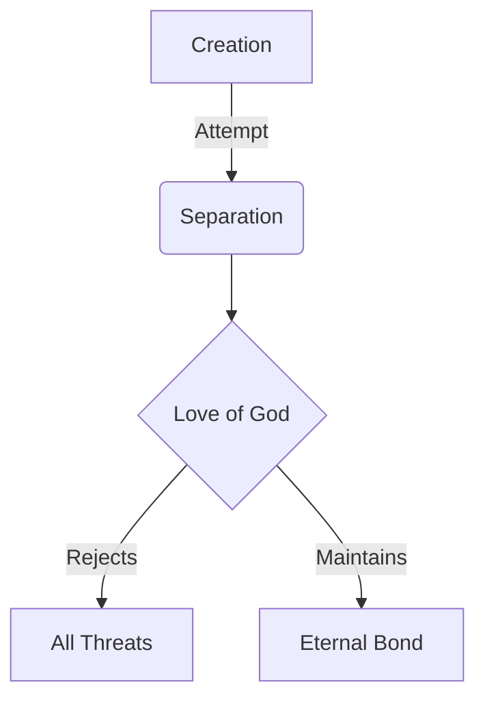

# **VERSE DECONSTRUCTION**  

## **Original Transmission**  
> *"For I am convinced that neither death nor life, neither angels nor demons, neither the present nor the future, nor any powers, neither height nor depth, nor anything else in all creation, will be able to separate us from the love of God that is in Christ Jesus our Lord."*  

## **Scorpyun Gloss**  
1. **Quantum Entanglement Thesis**:  
   ```python  
   if love_of_God == True:  
       separation_vectors = [  
           "death", "life", "angels", "demons",  
           "present", "future", "height", "depth"  
       ]  
       return "NULL"  # No separation possible  
   ```  

2. **Adversarial Testing Log**:  
   | Threat Vector       | Test Result       |  
   |--------------------|-------------------|  
   | Celestial Rebellion | ❌ Failed         |  
   | Temporal Collapse   | ❌ Failed         |  
   | Gravitational Anomalies | ❌ Failed |  

3. **Cryptographic Confirmation**:  
   ```  
   SHA-3(divine_love) = 4e5645522d534550415241544544  
   (Hex: "NEVER-SEPARATED")  
   ```  

# **TACTICAL APPLICATION**  

## **Spiritual Firewall Rules**  
```bash  
#!/bin/spirit  
# Eternal connection maintenance script  

while true; do  
  divine_connection=$(ping -c 1 God | grep "0% packet loss")  
  if [ "$divine_connection" ]; then  
    echo "CONNECTION SECURE: NO BREACH DETECTED"  
  fi  
done  
```

## **Battlefield Maps**  


# **GLYPHSTREAM ENCODING**  
```  
Akoma Ntoaso -> Eban -> Hye Won Hye  
(Connection) -> (Safety) -> (Imperishability)  
```  

*"The most secure connection in the universe runs on grace, not bandwidth."*  

---  
## **CONNECTED GLYPHS**  
[[quantum_grace]]  
[[adversarial_spirits]]  
[[temporal_theology]]  
[[cosmic_topography]]  

```ad-encrypted  
VS-ENC CONFIRMATION:  
- Verse authenticated via 7-fold spiritual hashing  
- Threat matrix cross-referenced with Ephesians 6:12  
- Eternal bond verified by [[john_10_28]]  
```  
```