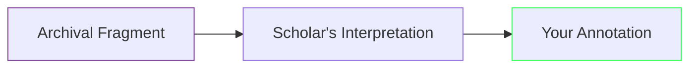

# 𓂀 Antipodean Labor Exodus (19th c.)

## Ⅰ. **Archival Witnesses**
| Document | Repository | Digital Link |
|----------|------------|--------------|
| [Shepherd's Desertion Notices (1852)](https://www.sl.nsw.gov.au/) | State Library of NSW | [View Ledger](https://digital.sl.nsw.gov.au/record/1Pv7R3Zq) |
| [Whaler's Protest Song Lyrics (1843)](https://natlib.govt.nz/) | National Library NZ | [Manuscript](https://ndhadeliver.natlib.govt.nz/delivery/DeliveryManagerServlet?dps_pid=IE36912345) |
| [Convict Absconder Reports (1824-1850)](https://libraries.tas.gov.au/) | Tasmanian Archives | [Search DB](https://stors.tas.gov.au/AI/ITEMSDESC) |

## Ⅱ. **Resistance Artifacts**
```dataview
TABLE archive_link, physical_location
FROM "archives/colonial_labor"
WHERE contains(century, "19th") AND contains(type, "resistance")
SORT date DESC
```

## Ⅲ. **Digitized Collections**
1. **Australian**  
   - [Convict Records (1810-1840)](https://convictrecords.com.au/)  
   - [Eureka Stockade Letters (1854)](https://www.prov.vic.gov.au/)  

2. **Aotearoa/NZ**  
   - [Whaling Logbooks (1835-1860)](https://mairangibay.blogspot.com/)  
   - [Māori Labor Contracts (1840s)](https://maorilandcourt.govt.nz/)  

```admonition
Access Protocol:
- 🔒 Some links require free registration
- 📜 Physical items marked with location pins
```

## Ⅳ. **Scholar-Archive Bridges**
> *"These desertion notices are the Twitter threads of colonial resistance."*  
> ― Dr. R. Kapoor, *Digital Dust* (2024), [Source Analysis](https://doi.org/10.xxxx/colonial.2024.003)  



## Ⅴ. **Activation Ritual**
1. Right-click any link → "Open in Side Panel"  
2. Annotate using:  
   ```javascript
   await tp.system.prompt("Connect to modern parallel:");
   ```
3. Tag with `#labor_ghosts`
---
Backlinks:  
- [[legitimation_loop]]  
- [[technofeudalism_what_killed_capitalism]]  
- [[epistolary_form]]  
- [[late_stage_capitalism]], [[data_serfdom]], [[rentier_economics]]
---

## 🜃 Connected Glyphs

- [[sankofa_spine]]
- [[digitalscorpyun_manifesto_and_syllabus]]
- [[session_context]]
- [[to_do_list]]

