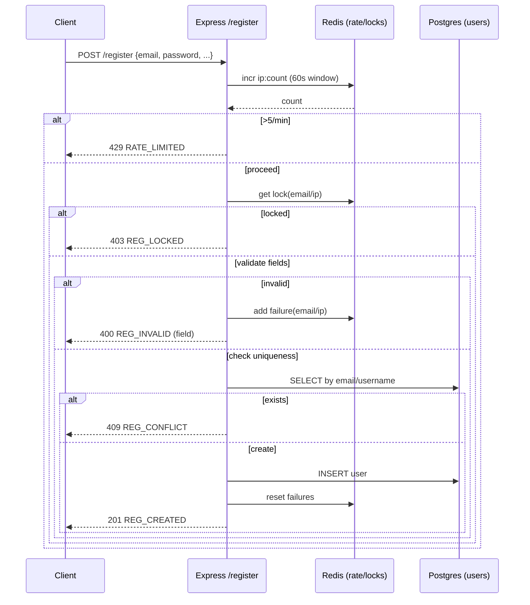
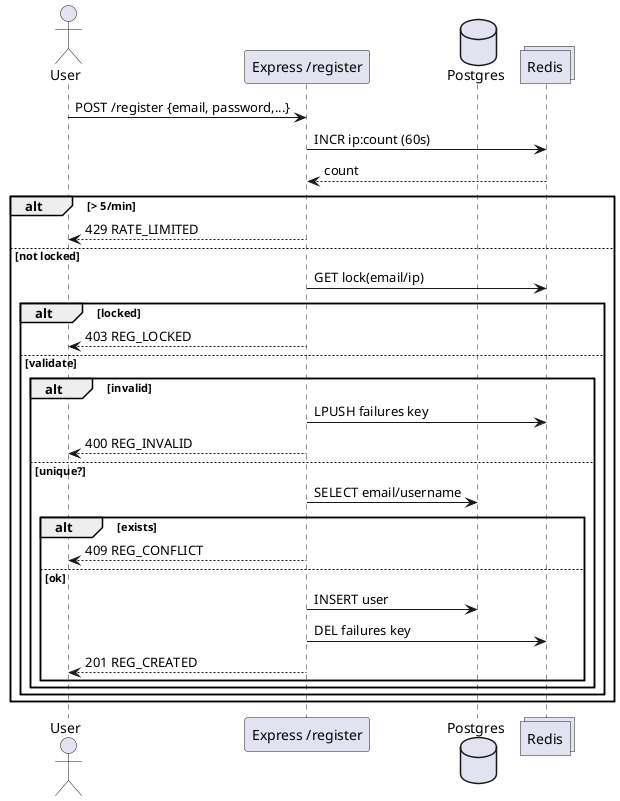

# Diagram Prompts for your Node/Express Register API (avm_ops)

## 1) Mermaid — Sequence (POST /register)


**Prompt template:**  
“Create a Mermaid *sequenceDiagram* for a Node/Express `/register` endpoint with Redis rate limits and lockouts and Postgres for users. Include 429, 403, 400, 409, 201 branches.”

## 2) Mermaid — System Overview (Flowchart)
```mermaid
flowchart LR
  U[User] -->|HTTPS| API[Registration API (Node/Express)]
  API -->|Read/Write| DB[(Postgres: users)]
  API -->|Counters/locks| REDIS[(Redis)]
  subgraph Security
    RL[Rate limit 5/min/IP]
    LK[Lock after 5 fails/15m]
  end
  API -.enforces .-> RL
  API -.enforces .-> LK
```

**Prompt template:**  
“Create a Mermaid flowchart showing user → Node/Express API → Postgres and Redis; annotate rate limit and lockout policies.”

## 3) PlantUML — Sequence


**Prompt template:**  
“Generate a PlantUML sequence diagram for `/register` with Redis (rate+lock) and Postgres. Show all response codes.”

## 4) C4-style Text Prompt (for LLM)
“Produce a C4 *Container* diagram description for ‘AVM Ops’. Containers: Web Client, Registration API (Node/Express), Redis (rate + locks), Postgres (users). Add relations: HTTPS, CRUD users, counters/locks. Output Mermaid or PlantUML.”
