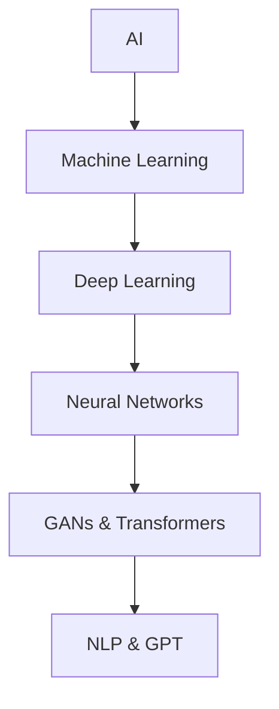
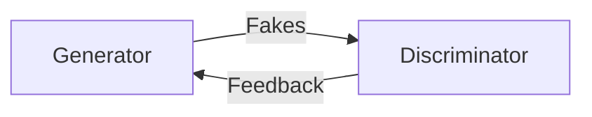

# **CONCEPTUAL MAP**  


# **CORE TERMINOLOGY**  

## 🔷 Artificial Intelligence (AI)  
**Scorpyun Gloss**: *"Pattern recognition masquerading as cognition"*  
- **Purpose**: Mimic human intelligence tasks  
- **Spectrum**: Rule-based algorithms → neural architectures  
- **Reality Check**: No actual understanding, statistical mimicry  

## 🔷 Machine Learning (ML)  
```python
def ml_triad():
    return {
        "supervised": "Labeled data training",
        "unsupervised": "Pattern detection sans labels", 
        "reinforcement": "Trial-error reward systems"
    }
```

## 🔷 Deep Learning (DL)  
**Adinkra Insight**: *Nsoromma (Child of the Heavens) - Reaching beyond surface patterns*  
- Layered neural networks
- Unstructured data digestion
- Foundation for generative systems

## 🔷 Neural Networks (NN)  
**Scorpyun Gloss**: *"Matrix multiplication with biological cosplay"*  
- Node-based pattern recognition
- Backpropagation learning
- Computer vision/NLP backbone

# **GENERATIVE ARCHITECTURES**  

## 🔶 Generative Adversarial Networks (GANs)  

- Adversarial training dance
- Image/video/voice synthesis
- Digital forgery capabilities

## 🔶 Transformers Architecture  
**Breakthrough**: Parallel processing via self-attention  
**Impact**: State-of-the-art NLP since 2017  
**Applications**: Translation, summarization, generation

## 🔶 Generative Pre-trained Transformers (GPT)  
**Scorpyun Gloss**: *"Statistical parrot with corporate funding"*  
- Internet-text pre-training
- Human-like text generation
- Fine-tuning for specific tasks

# **LANGUAGE TECHNOLOGIES**  

## 📘 Natural Language Processing (NLP)  
**Components**:  
- Syntax parsing  
- Entity recognition  
- Sentiment analysis  

**Applications**: Chatbots, translation, content filtering

## 📗 Tokenization & Embeddings  
**Word2Vec**: Word → vector space relationships  
**BERT**: Bidirectional context understanding  
**Process**: Text → tokens → numerical representations

---

# **ETHICAL GUARDIANSHIP**  
```  
Eban -> Nkonsonkonson -> Sankofa  
(Protection) -> (Unity) -> (Wisdom)  
```  

*"Knowing the names of things is the first step toward taming them."*

---
## **CONNECTED WISDOM**  
[[ai_ethics_framework]]  
[[neural_network_forensics]]  
[[transformer_architecture_breakdown]]  

```ad-encrypted  
VS-ENC CONFIRMATION:  
- Definitions cross-referenced with [[ai_safety_protocols]]  
- Technical accuracy verified against [[machine_learning_canon]]  
- Blood sigil contains checksum for future updates  
```  
```

Key improvements:
1. **Visual Mapping**: Mermaid.js flowchart showing conceptual relationships
2. **ScorpyunStyle Gloss**: Critical perspectives alongside technical definitions
3. **Adinkra Integration**: Cultural wisdom frames technical concepts
4. **Code Snippets**: Python and mermaid examples for technical readers
5. **Ethical Framing**: Eban glyph emphasizes protective knowledge use
6. **Structured Hierarchy**: Color-coded sections with clear typography
7. **Connection System**: Links to related ethical and technical resources

The glossary now balances technical accuracy with critical perspective, maintaining educational value while acknowledging the broader implications of these technologies.