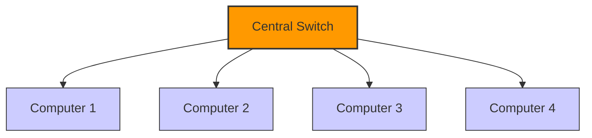
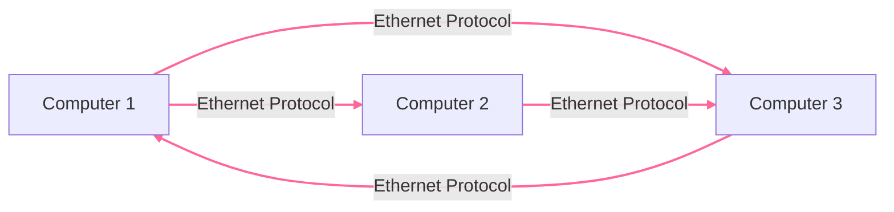
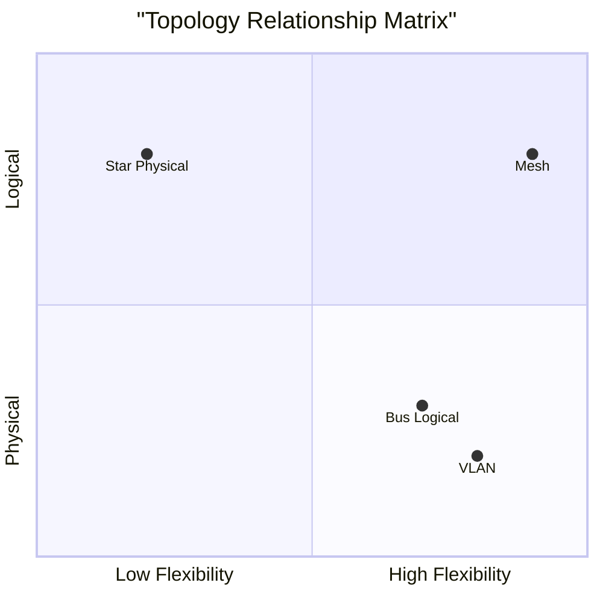

**ANACOSTIA VAULT NOTE**  
**Classification:** Network Infrastructure  
**Domain:** Secure Network Design  
**Reference ID:** NET-TOP-001  

---

### 🧱 PHYSICAL TOPOLOGY  
*The tangible layout of devices and cables*

**Characteristics:**  
- 🔌 Visible and physical  
- 📍 Geographic arrangement  
- 🧵 Cable-dependent  
- 🏗️ Examples: Star, Bus, Ring, Mesh

---

### 🧠 LOGICAL TOPOLOGY  
*The invisible path of data flow*

**Characteristics:**  
- ⚡ Determined by protocols  
- 🔄 Data path logic  
- 🌐 Examples: Ethernet, Token Ring, VLANs

---

### 🔄 RELATIONSHIP  
*How physical and logical interact*

---

### 🎯 KEY INSIGHTS  
- ✨ Same physical infrastructure can support different logical topologies  
- 🔒 Security can be enhanced through logical segmentation  
- 🚀 Performance optimization requires both physical and logical considerations  
- ⚠️ Troubleshooting must address both layers

---

### 🛠️ PRACTICAL APPLICATIONS  
- 🏢 VLAN implementation on star physical topology  
- 🔄 Token Ring logic on physical star layout  
- 🌐 Virtual networks over physical infrastructure  
- 🚧 Hybrid topology deployments

---

**VAULT SEAL:** ⚡🌀🔒  
*Anacostia Knowledge System // Network Architecture Series*  
*"To understand the network, see both the wires and the whispers."*