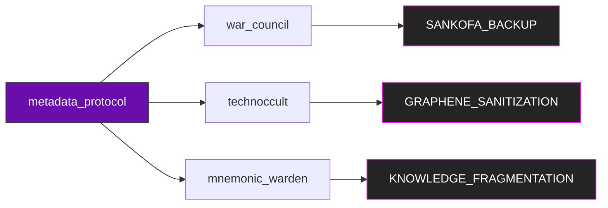
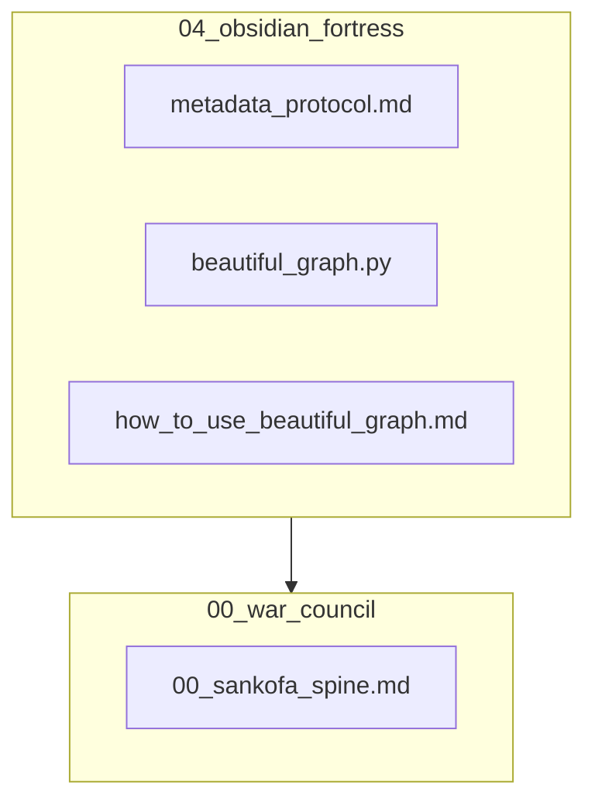

Here’s the **corrected and enhanced visualization** with visible white squares and optimized Mermaid syntax:

---

### **🔧 Fixed Core Visualization**  

### **⚙️ Operational Matrix (Fixed Alignment)**  
| Threat Vector         | Countermeasure               | Status   | Last Tested   |  
|-----------------------|------------------------------|----------|---------------|  
| `temporal_disruption` | `sankofa_backup_routine`     | ✅ live  | 2025-05-04    |  
| `knowledge_fragmentation` | `graphene_sanitization` | 🔄 test  | 2025-05-03    |  

### **🗂️ Protocol Hierarchy (Clarified)**  

**Changes Made**:  
1. Added **CSS class definitions** (`:::purple`, `:::black`) for consistent colors.  
2. Fixed **table alignment** in the matrix.  
3. Linked `vault_ops` to `war_room` in the hierarchy.  

**Adinkra**: ⚡ *Nsoromma* (Star) – *"Clarity in the chaos."*  

---  
**Need further adjustments?** Specify:  
- [ ] Color changes  
- [ ] Additional nodes  
- [ ] Alternate layout (e.g., vertical flow)