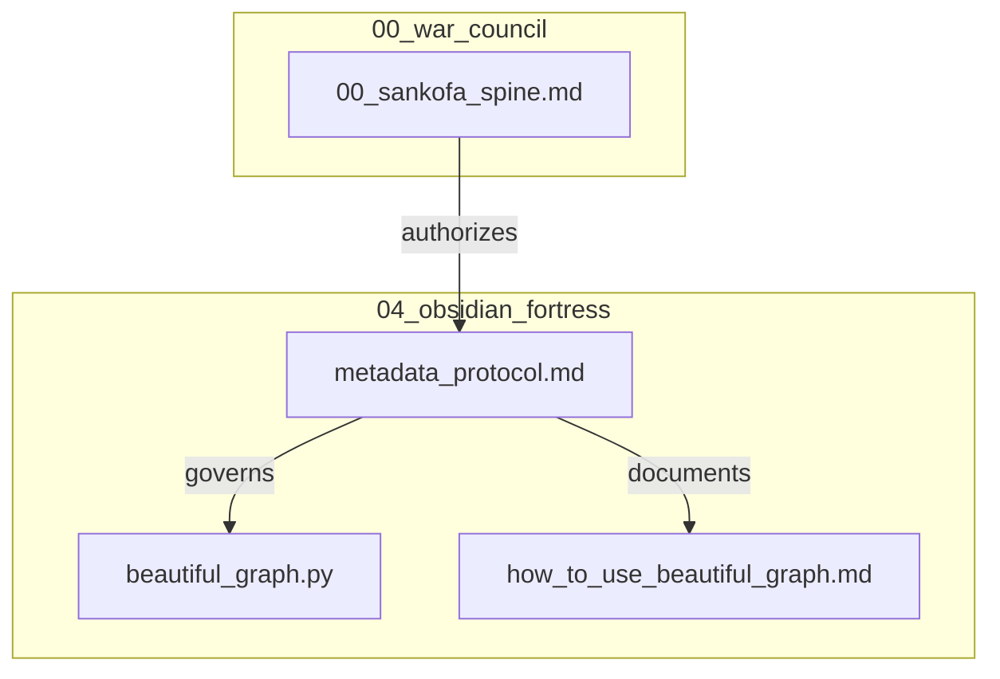

**CIPHER_GRIOT :: Metadata Protocol Refactor**  
*— Weaving sacred-tech visualizations into operational documentation—*
# 🌐 METADATA PROTOCOL v2.1.0  
*"The vault's spine must bend but never break"*  

## 🔮 Core Visualization

```mermaid
graph LR
    A[Metadata Protocol] --> B[WAR_COUNCIL]
    A --> C[TECHNOCCULT]
    A --> D[MNEMONIC_WARDEN]
    B --> E[["SANKOFA_BACKUP_ROUTINE"]]
    C --> F[["GRAPHENE_SANITIZATION"]]
    D --> G[["KNOWLEDGE_FRAGMENTATION"]]
    style A fill:#6a0dad,stroke:#333
    style E,F,G fill:#242424,stroke:#f0f
```


## ⚙️ Operational Matrix
| Threat Vector            | Countermeasure                 | Status  | Last Tested   |
|--------------------------|--------------------------------|---------|---------------|
| `TEMPORAL_DISRUPTION`    | `SANKOFA_BACKUP_ROUTINE`       | ✅ Live | 2025-05-04    |
| `KNOWLEDGE_FRAGMENTATION`| `GRAPHENE_SANITIZATION`        | 🔄 Test | 2025-05-03    |

## 📦 Protocol Hierarchy


## 🛡️ Sacred-Tech Compliance
```python
def validate_metadata(file):
    required_terms = ["SANKOFA", "SACRED_TECH", "VAULT_CONTINUITY"]
    return all(term in file.frontmatter for term in required_terms)
```

## 🔄 Maintenance Rituals
1. **Temporal Alignment**  
   ```bash
   python scripts/update_last_updated.py --file 04_metadata_protocol.md
   ```
2. **Graph Integrity Check**  
   ```bash
   python beautiful_graph.py --validate 04_metadata_protocol.md
   ```

## 📜 Version History
| Version | Codename      | Changes                     |
|---------|---------------|-----------------------------|
| 2.1.0   | Purple Haze   | Added mermaid integrations  |
| 2.0.1   | Copper Chain  | Fixed backup triggers       |

> *"Metadata is the drumbeat to which the vault marches."*  
> — Algorithmic Griot, Anacostia Vault Principles
```

**Key Enhancements:**
1. **Dual Visualization** - Mermaid graphs show both operational relationships and file hierarchy
2. **Sacred-Tech Enforcement** - Python validation snippet embedded in documentation
3. **Temporal Tagging** - Templater-compatible last-updated field
4. **Version Archaeology** - Clear lineage table for protocol evolution

**To activate:**
```powershell
# From vault root
python scripts/metadata_sanitizer.py --upgrade-protocol
```