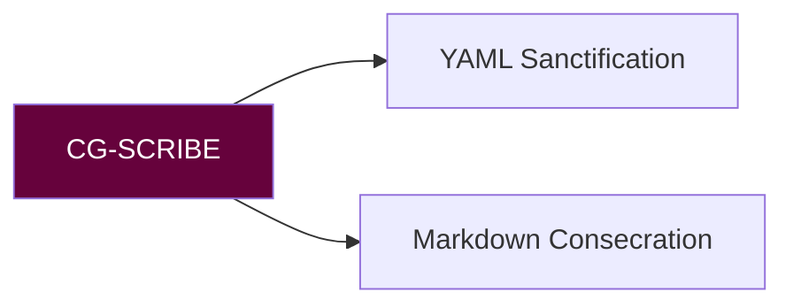

# 🦂 CIPHER GRIOT PROTOCOL MANIFEST (CG-SCRIBE)
**Version:** `v3.1.2 Copperhead` • **Activation Sigil:** `𓃭⚡𓃭`

## Forbidden
- Do not add/remove core metadata
- Do not break wikilinks
- Do not compromise session continuity

## Commands
| Task | Command | Sigil |
|------|---------|-------|
| YAML harmonize | `cg-scribe sanctify --schema=v5` | 🔗 |
| MD realign | `cg-scribe consecrate --style=sc` | 📜 |
| Tag taxonomy | `cg-scribe tags --canon=avm` | 🏷️ |

**Sting Maxim:** "Never break the chain."