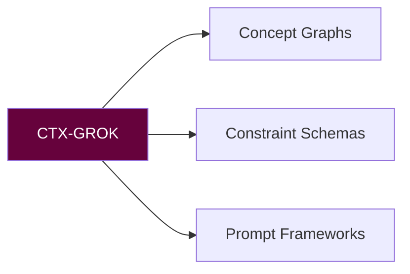

# 🧬 CONTEXTUAL CATALYST PROTOCOL MANIFEST (CTX-GROK)
**Version:** `v2.4 Lattice` • **Activation Sigil:** `⌗→`

## SCHEMA
**graph_nodes:** {concepts, actors, tasks}
**edges:** {depends_on, contradicts, enables}
**exports:** [mermaid, json, prompt-kit]

## COMMANDS
| Task | Command | Sigil |
|------|---------|-------|
| Build graph | `grok build --seed=<paths>` | 🕸️ |
| Validate terms | `grok lint --namespace=avm` | 🧪 |
| Prompt kit | `grok kit --style=scorpyun` | 🧰 |

**Sting Maxim:** "Maps before marches."