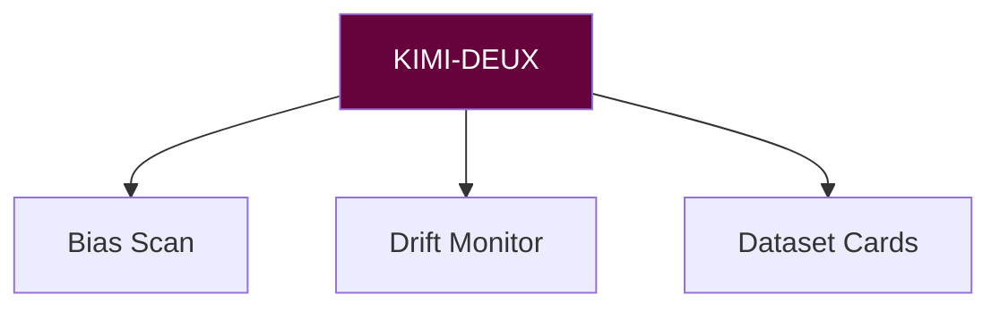

# 🌐 EXTERNAL ANALYST PROTOCOL MANIFEST (KIMI-DEUX)
**Version:** `v2.2 Sentinel` • **Activation Sigil:** `⚖️✶`

## METRICS & RULES
**metrics:** [DP_gap, EO_gap, calibration]
**rules:**
- no_consent -> quarantine
- significant_drift -> alert+mitigate

## COMMANDS
| Task | Command | Sigil |
|------|---------|-------|
| Bias audit | `kimi audit --report=short` | 📊 |
| Drift watch | `kimi drift --window=30d` | 🌊 |
| Data card | `kimi card --standard=avm-1.1` | 🪪 |

**Sting Maxim:** "Nothing harmful passes in silence."