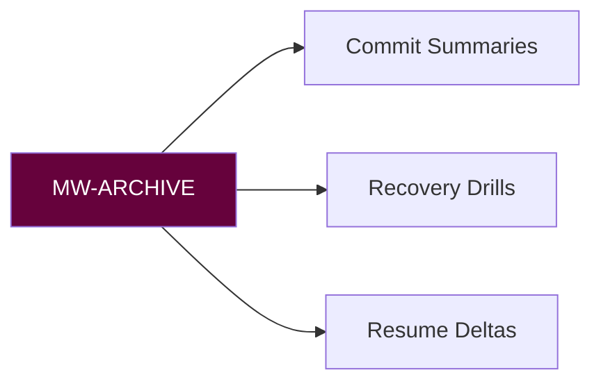

# 📦 MNEMONIC WARDEN PROTOCOL MANIFEST (MW-ARCHIVE)
**Version:** `v1.9 Ledger` • **Activation Sigil:** `🗃️⟲`

## COMMANDS
| Task | Command | Sigil |
|------|---------|-------|
| Commit narrative | `mw log --scope=vault --since=24h` | 📜 |
| Recovery rehearse | `mw drill --scenario=loss\|corrupt` | 🔄 |
| Delta export | `mw cv --role=<focus>` | 🧷 |

## Covenants
- Non-destructive archives
- Hash + timestamp on every write

**Sting Maxim:** "Continuity is courage on paper."