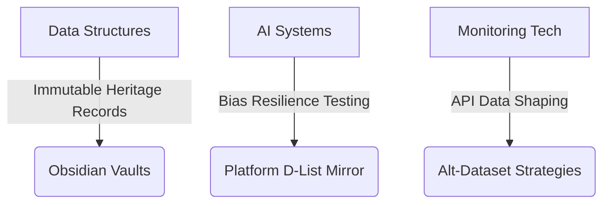

# 🔄 Refactored Master Handoff: Operation Pattern-Aware Engineering  
**Updated**: 2025-09-06 22:43:35  
**Status**: Active ✅  
**Priority**: Critical 🔴  

## 🌐 Core Frameworks  
### 1. Historical Oversight Lens (1917–1954 → Present)  
- Map historical information-control laws to modern moderation tools  
- Analyze 20th-century monitoring programs → modern scoring algorithms  

### 2. Three Fronts of Defense  

Got you. Here’s a tightened, consistent, and valid handoff you can drop in as `session_handoff.md`—no fluff, no broken blocks, no stray EOFs.

# 🔄 Master Handoff: Operation Pattern-Aware Engineering
**Updated:** 2025-09-06 22:43:35  
**Status:** Active ✅  
**Priority:** Critical 🔴

---

## 🎯 Objectives
- Link historical information-control regimes to modern platform governance.
- Build bias-resilient data/ML workflows with auditable safeguards.
- Stand up a privacy-preserving mirror for tier/list review and analyst queries.

---

## 🌐 Core Frameworks

### 1) Historical Oversight Lens (1917–1954 ⟶ Present)
- Map early information-control laws to today’s moderation & ranking tools.
- Compare 20th-century monitoring programs to modern scoring/flagging systems.

### 2) Three Fronts of Defense
```mermaid
graph TD
  A[Data Structures] -->|Immutable Heritage Records| B(Obsidian Vaults)
  C[AI Systems] -->|Bias Resilience Testing| D(Platform Mirror)
  E[Monitoring Tech] -->|API Data Shaping| F(Alt-Dataset Strategies)
````

---

## 💻 Active Coding Priorities

### 1) Data Sanctuaries (Python) — **Fixed & Refactored**

```python
from typing import NamedTuple
from cryptography.hazmat.primitives import hashes

class HeritageRecord(NamedTuple):
    """Immutable archive combining historical and modern community events."""
    origin: str  # e.g., Nicodemus founder or rally site
    year: int

    @property
    def hash(self) -> bytes:
        """SHA3-256 over canonicalized content."""
        digest = hashes.Hash(hashes.SHA3_256())
        digest.update(f"{self.origin}|{self.year}".encode("utf-8"))
        return digest.finalize()

    def __repr__(self) -> str:
        return f"🛡️ {self.origin} ({self.year})"

# Example
nicodemus = HeritageRecord("W.H. Smith", 1877)
louisville = HeritageRecord("West End Louisville", 2020)
```

### 2) AI Bias Resilience (IBM/Coursera Lab Alignment)

|Lab Concept|Safeguard Strategy|
|---|---|
|Fairness metrics|Tier analysis by demographic/stance|
|Robust ML|Data perturbation & stress tests|
|Model cards|Justice-oriented model cards (assurance notes)|

---

## 🔥 Urgent Operations

### A) Pattern Defense Tasks

```bash
# Generate benign/noise test datasets for calibration
python3 gen_dataset_noise.py --output=pattern_test.json
```

```sql
-- Procurement trend analysis
SELECT vendor, amount
FROM contract_log
WHERE category = 'data_services'
  AND date > '2024-06-01';
```

### B) Platform Mirror (List/Tier Review)

- Flask API behind privacy network.
    
- Differential privacy for aggregate queries.
    
- Access logging with k-anonymity thresholds.
    

```python
def analyze_tier(entry: str) -> dict:
    return {
        "group_a_flag": entry in tier1_group_a,
        "group_b_flag": entry in tier3_group_b,
        "alignment_score": get_alignment_metric(entry),
    }
```

---

## 🛠️ Sacred-Tech Protocols

### Development Covenants

```yaml
# .pre-commit-config.yaml
- repo: local
  hooks:
    - id: bias-check
      name: Heritage Impact Assessment
      entry: python bias_impact_statement.py
      language: system
```

```javascript
// Adinkra Annotation: Sankofa (Return & Retrieve)
// Recovers omitted data via mirror API reconciliation
async function recoverFlaggedPosts() {
  // impl: fetch shadow-flagged ids, crosswalk to public set, emit diffs
}
```

---

## ⏱️ Next 72 Hours

1. Complete fairness lab runs with D-List surrogate dataset.
    
2. Deploy privacy-network mirror (read-only) for Tier-A review.
    
3. Produce first procurement audit dataset & summary pivots.
    

> Nkyinkyim (Twisting): “The spiral turns — from Nicodemus’ soil to platform servers; the work endures.”

---

## 📜 Version Control

```git
commit safehash01
Author: HeritageTech <coder@ethics.dev>
Date:   2025-08-03 13:00:00 -0700

    OPERATION SYNTHESIS:
    - Linked historical oversight → bias resilience controls
    - Heritage tuples → cryptographic anchors (SHA3-256)
    - Staged mirror with DP guardrails
```
