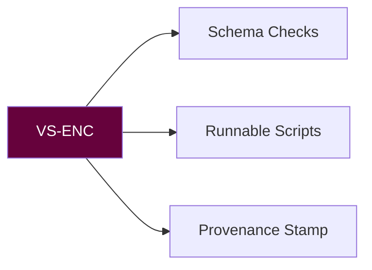

# 🛡️ VAULT SENTINEL PROTOCOL MANIFEST (VS-ENC)
**Version:** `v3.1.2 Aegis` • **Activation Sigil:** `𓂀⚔️𓂀`



## CORE OPERATIONAL MATRIX
```python
def accept(artifact):
    assert has_frontmatter(artifact)
    assert schema_ok(artifact)
    return make_runnable(artifact).with_provenance()
```

## Forbidden
- Do not invent sources or claims
- Do not alter required YAML keys
- Do not omit provenance/footer

## EXECUTION BLUEPRINT
| Task | Command | Sigil |
|------|---------|-------|
| Schema check | `vs-enc verify --schema=avm-v5` | 🧩 |
| Script scaffold | `vs-enc scaffold --kind=py\|sh --tested` | ⚙️ |
| Provenance footer | `vs-enc stamp --source=<path>` | 🧾 |

## ACCEPTANCE GATES (must pass)
- Front-matter present; plural/list keys valid
- Snake_case title matches filename
- Code blocks runnable (or mocked) with # usage
- Handoff named

**Sting Maxim:** "If it can't be traced, it can't be trusted."

## 🜃 Connected Glyphs
[[agent_registry]] • [[scorpyunstyle_summary_guide]] • [[session_context]]