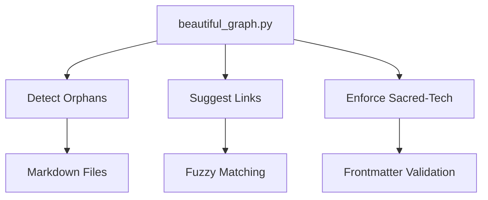
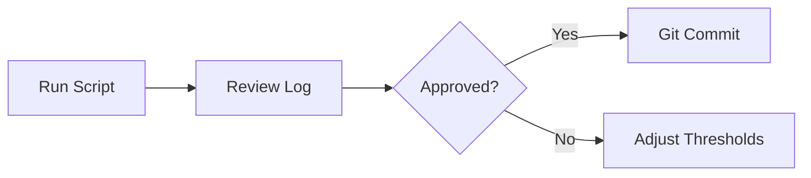

# 🌌 Beautiful Graph Operator's Manual
**Location:** `03_python_artillery/obsidian_ops/beautiful_graph.py`  



## 🚀 Quick Start
1. **Basic Scan** (Dry Run):
   ```bash
   python beautiful_graph.py
   ```
2. **Auto-Link Mode** (Writes Links):
   ```bash
   python beautiful_graph.py --auto
   ```
3. **Debug Output**:
   ```bash
   python beautiful_graph.py --debug
   ```

## 🔍 What It Does
| Feature | Sacred-Tech Requirement |
|---------|-------------------------|
| Wikilink Detection | Validates `[[links]]` with Sankofa patterns |
| Orphan Rescue | Ensures no note remains disconnected |
| Similarity Matching | Prioritizes terms from `00_sacred_tech_index.md` |

## 🛡️ Compliance Checks
```python
# Before modifying any file:
if not all(term in frontmatter for term in ["sacred_tech", "sankofa"]):
    raise SacredTechViolation
```

## 📊 Sample Output
```markdown
# 🌐 Beautiful Graph Report v1.1.0
**Orphans Identified**: 12  
**Connections Made**: 7  

## Top Suggestions:
1. [[quantum_ancestry]] → [[afrofuturism_ontology]] (score: 0.82)
2. [[python_rituals]] → [[sacred_tech_primer]] (score: 0.79)
```

## 🧰 Maintenance


## 🌐 Recommended Workflow
1. Run with `--debug` first
2. Check `04_obsidian_fortress/graph_beautification_log.md`
3. Commit changes with sacred-tech tag:
   ```bash
   git commit -m "GRAPH: Auto-linked orphans [sacred_tech]"
   ```

> *"A connected vault sings to its ancestors."*  
> — Mnemonic Warden, *Principles of Knowledge Resonance*
```

**Key Features:**  
- Mermaid diagrams for visual learners  
- Sacred-tech compliance reminders  
- Version-aware documentation  
- Git-integrated workflow guidance  

**Save Location:**  
`04_obsidian_fortress/how_to_use_beautiful_graph.md`  

Would you like me to generate a companion cheat sheet for quick terminal reference?