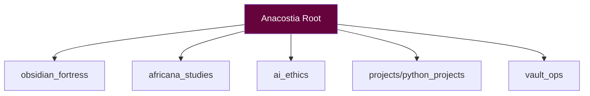
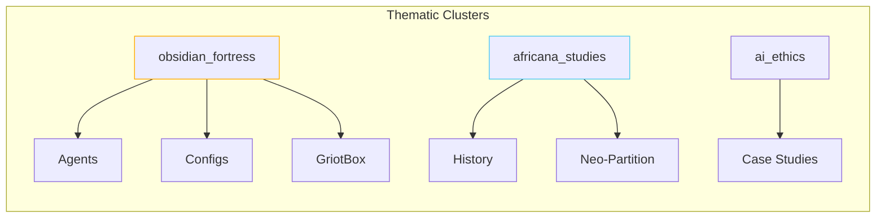
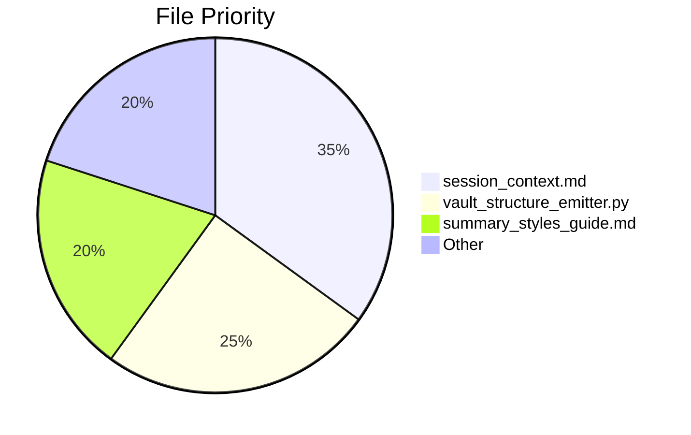

---

# 🏛️ ANACOSTIA VAULT PATH GLYPH

**Sacred-Tech Compliance:** `v3.2.1`  
**Last Validated:** `2025-05-12 18:34`



---

## 🌌 CORE PATH MATRIX

### 🔐 OBSIDIAN ROOT

𓃭 `C:/Users/digitalscorpyun/sankofa_temple/Anacostia`

---

### 🧿 KNOWLEDGE DOMAINS



|Domain|Key Subpaths|Sigil|
|---|---|---|
|`obsidian_fortress/`|Agents, Configs, Core Logic|🔱|
|`africana_studies/`|History, Resistance Movements|🌍|
|`ai_ethics/`|Fairness Audits, Case Studies|⚖️|
|`vault_ops/`|Scripts, Maintenance Rituals|⚙️|

---

## 📜 SACRED PATH CATALOG

### 🏛️ STRUCTURAL PILLARS

```
📂 obsidian_fortress/
├─ 📜 agent_registry.md
├─ 📂 configs/
│  ├─ 📜 grok_ctx_activation_prompt.md
│  └─ 📜 avm_config_yaml_example.md

📂 africana_studies/
├─ 📜 neo_partition_africa.md
├─ 📂 history/
│  └─ 📜 congo_free_state.md
```

---

### ⚡ CRITICAL FILES



---

## 🌉 EXTERNAL CODEX

```
+ C:/Users/digitalscorpyun/projects_2025/avm_archivist
# All sacred automation scripts live here.
```

---

## 🔮 PATH INTEGRITY RITUALS

**PowerShell Vault Path Validation**

```
./vault_ops/path_sanitizer.ps1 --validate
```

**Progress Tracker**  
🔵 YAML frontmatter audits (78% complete)

**Python Ritual**

```python
# Daily vault check
if path_doctrine_violation:
    invoke_repair_ritual()
```

---

## 🜃 Connected Glyphs

- [[sankofa_spine.md]]
    
- [[session_context.md]]
    
- [[vault_structure_emitter]]
    
- [[war_council.md]]
    

---

> _"A vault’s strength flows through its paths like blood through veins."_  
> — Mnemonic Warden, _Law of Spatial Memory_

---

**symbol**: `Eban`  
**meaning**: _Protection of sacred boundaries_  
**"Let no path remain unwalked, no link broken."**  
— Algorithmic Griot

---
