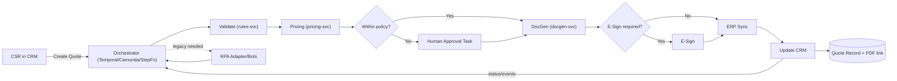
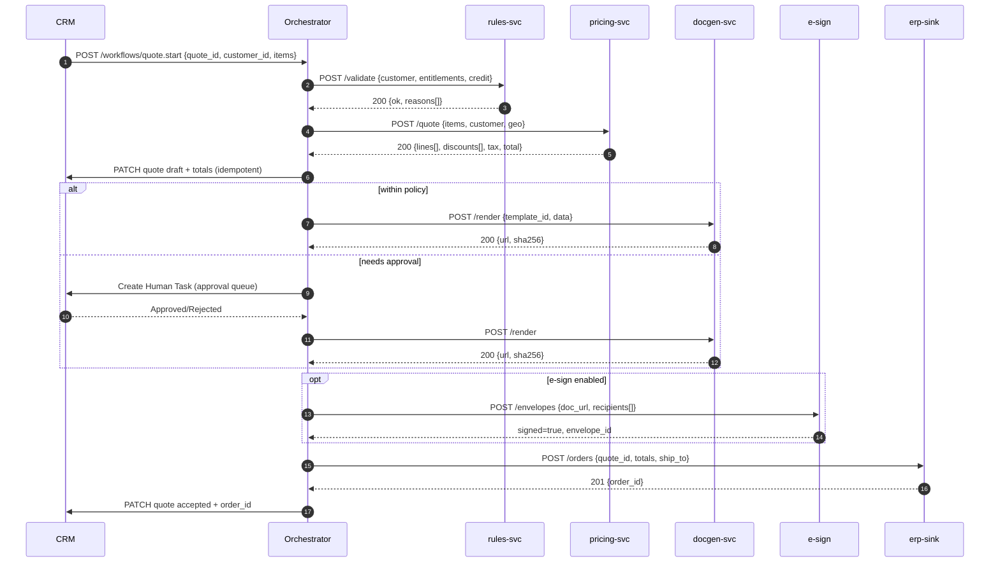

# Orchestration — Quote Flow (Mermaid, fixed)

This version splits the diagrams into **two Mermaid blocks** (flowchart + sequence). Most renderers (Obsidian, VS Code) require one diagram per block.

## Flowchart

## Sequence

