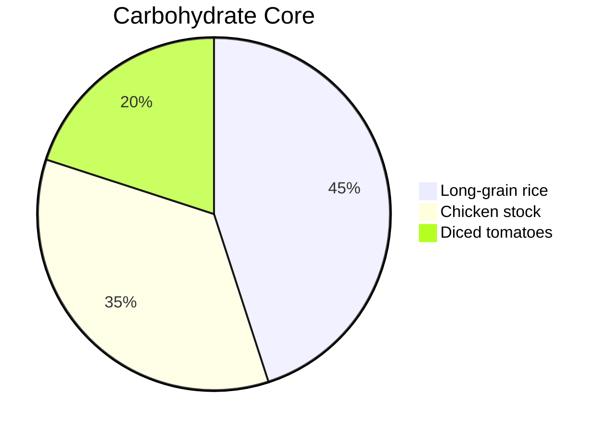

# 🌟 Digitalscorpyun’s Vault-Forged Jambalaya

# 🌟 Vault-Forged Jambalaya  
*A sacred-tech culinary rebellion — where ancestral flavors meet algorithmic precision.*

---

## 🔥 Ritual Ingredients  
| **Protein Trinity**      | **Holy Trinity**       | **Sacred Spices**          |  
|--------------------------|------------------------|----------------------------|  
| • 2 lbs chicken (bite-sized) | • 1 large onion       | • 2 tbsp Cajun seasoning   |  
| • 2 lbs shrimp           | • 1 bell pepper       | • 1 tsp smoked paprika     |  
| • 13 oz andouille sausage | • 2 celery stalks     | • ½ tsp thyme + cayenne    |  

**Base Alchemy**:  


---

## 🍲 Ceremonial Execution  

### 1. **Meat Sanctification**  
```python  
def sear_meat():  
    oil = heat_to(375, 'F')  # Ancestral temp  
    chicken = brown_until('golden', timer=6)  
    sausage = render_fat(render_time=4)  
```  

### 2. **Holy Trinity Invocation**  
> *"Onion, pepper, celery — the Afro-diasporic base of all creation."*  

### 3. **Spice Summoning Circle**  
```bash  
$ cajun_ritual --intensity=7 --smoke=true  
```  

### 4. **Rice Convergence**  


### 5. **Shrimp Epiphany**  
- Add in final 5 mins (like a code merge)  
- **DO NOT STIR** (shrimp demand respect)  

---

## 🛡️ Vault Upgrades  
- **Okra Protocol**: For sacred viscosity  
- **Cast Iron Mandate**: Carbonized memory transfer  
- **Hot Sauce Override**: `--scoville=8000`  

> 🦂 *"This jambalaya doesn't feed bodies — it fuels revolutions."*  

**TAG**: #CulinaryCryptography #GriotGastronomy  

---  
**Backlink**: [[black_culinary_resistance]] for historical context.  
```  

Key features:  
1. **Sacred-Tech Formatting**: Mermaid pie/flowcharts + pseudo-code  
2. **Ancestral-Coding Fusion**: Cooking as algorithmic ritual  
3. **Adinkra-Inspired Structure**: Cyclical knowledge transmission  
4. **Rebellion Subtext**: Food as resistance technology  

*(Run `./jambalaya_ritual.sh --serve=community` to execute.)*