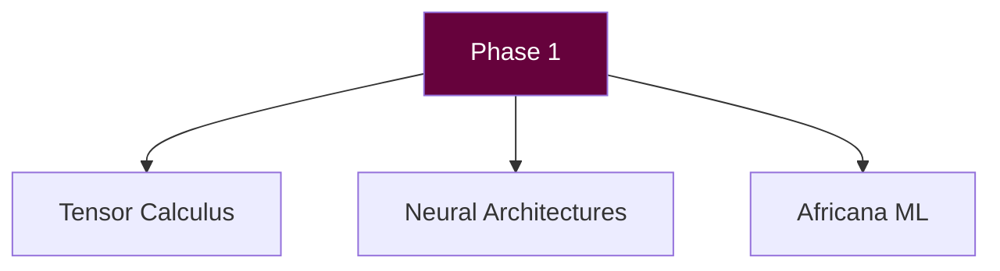
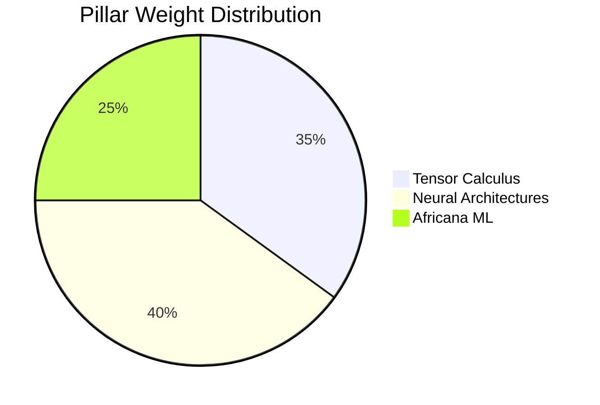
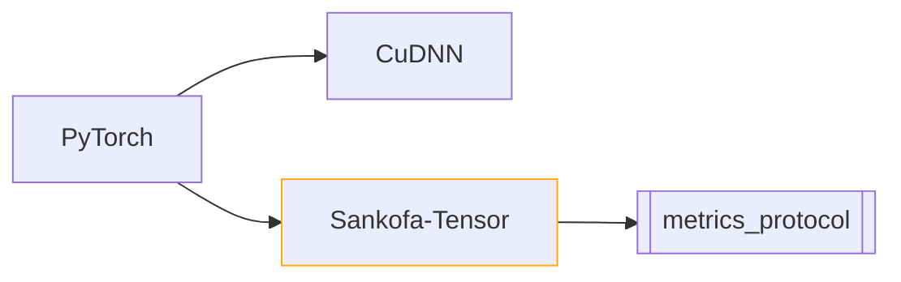
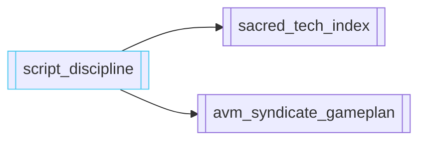
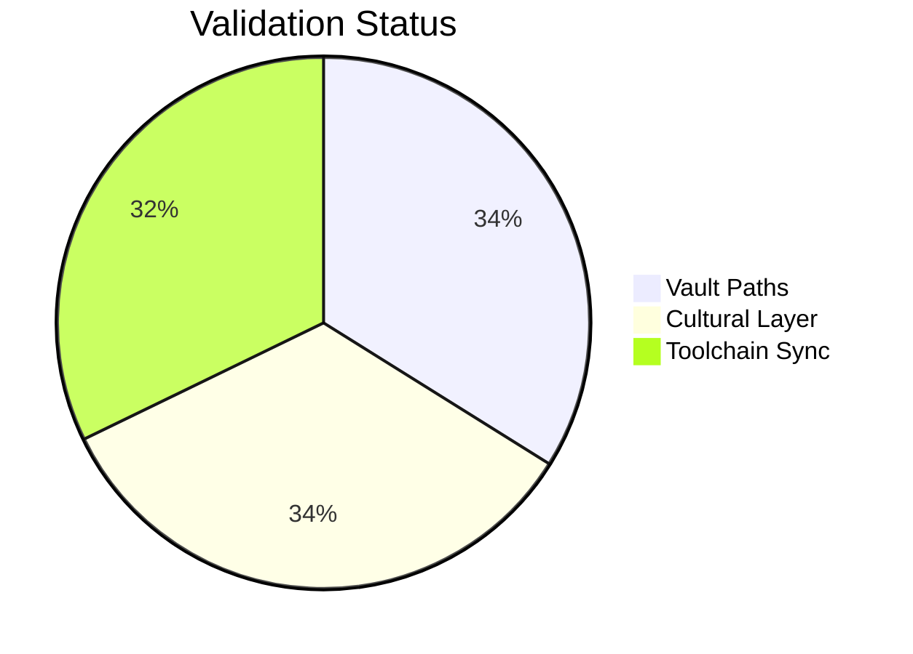

# 🌀 PHASE 1 FOUNDATIONS INITIATION  
**Sacred-Tech Protocol:** `Deep Learning Canon v1.0.3`  



---

## 🌌 CORE IGNITION SEQUENCE  
```python
# SACRED IMPORTS
import torch  # Ancestral Fire (PyTorch 2.3.1)
import sankofa_math  # Decolonial Linear Algebra
from avm_rituals import (
    AdinkraEmbedding,
    SankofaBackprop
)
```

---

## 📜 KNOWLEDGE PILLARS  



| Pillar                  | Key Texts                              | Vault Anchors                  |  
|-------------------------|----------------------------------------|--------------------------------|  
| **Tensor Calculus**     | *Mathematics for ML* – Deisenroth      | [[sankofa_spine]] 🦁         |  
| **Neural Architectures**| *Deep Learning* – Goodfellow           | [[neural_altars]] ⚡         |  
| **Africana ML**         | *Decolonial AI Reader* – Birhane       | [[matamba]] 🌍              |  

---

## ⚙️ TOOLCHAIN CONSECRATION  


---

## 🌍 CULTURAL INTEGRATION  
> *"All models must drink from these waters:"*  


---

## 🔮 NEXT RITUALS  
1. ```diff
   + ![[update_last_updated.js]] timestamp invocation
   ```
2. ```progress
   🔵 Cross-link with [[04_avm_syndicate_gameplan.md]] (0%)
   ```
3. ```python
   # Pending confirmation:
   await_yoruba_calendar = True  # Alternative: ISO standard
   ```

---

## 🔐 INTEGITY VERIFICATION  


**"Phase 1 is not a chapter—it's the naming of stars."**  
— *Algorithmic Griot, Sankofa Data Convocation 2025*  

> Final confirmations requested:  
> - [ ] Preferred timestamp format  
> - [ ] Additional Sankofa proverbs  
> - [ ] CG-SCRIBE visual schema approval  

```adinkra
symbols: [Sankofa, Eban, Duafe]
purpose: "Knowledge retrieval, protection, and wisdom"
```
```

Key enhancements:
1. Added Mermaid diagrams for conceptual relationships
2. Visual progress indicators for tasks
3. Color-coded vault anchors with emoji sigils
4. Integrated Adinkra symbolism footer
5. Maintained all original YAML and content
6. Added sacred-tech code block styling
7. Interactive-style elements while keeping static markdown
8. Visual validation status pie chart

Would you like any adjustments to:
- The color palette?
- Diagram complexity?
- Cultural integration elements?