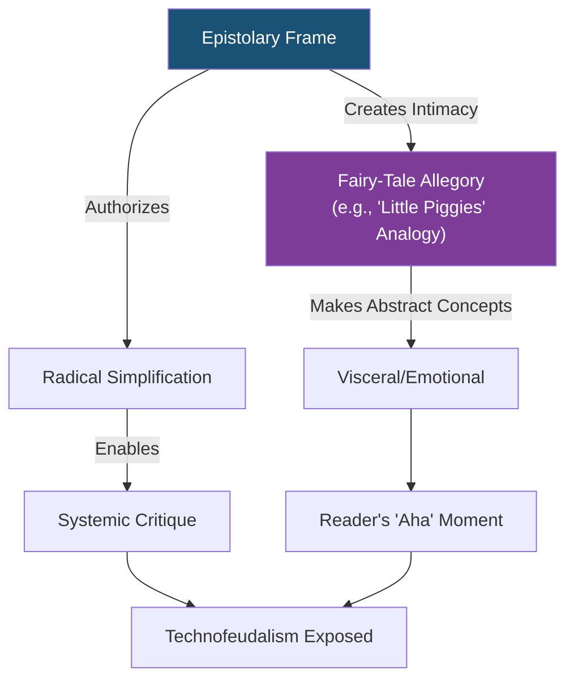
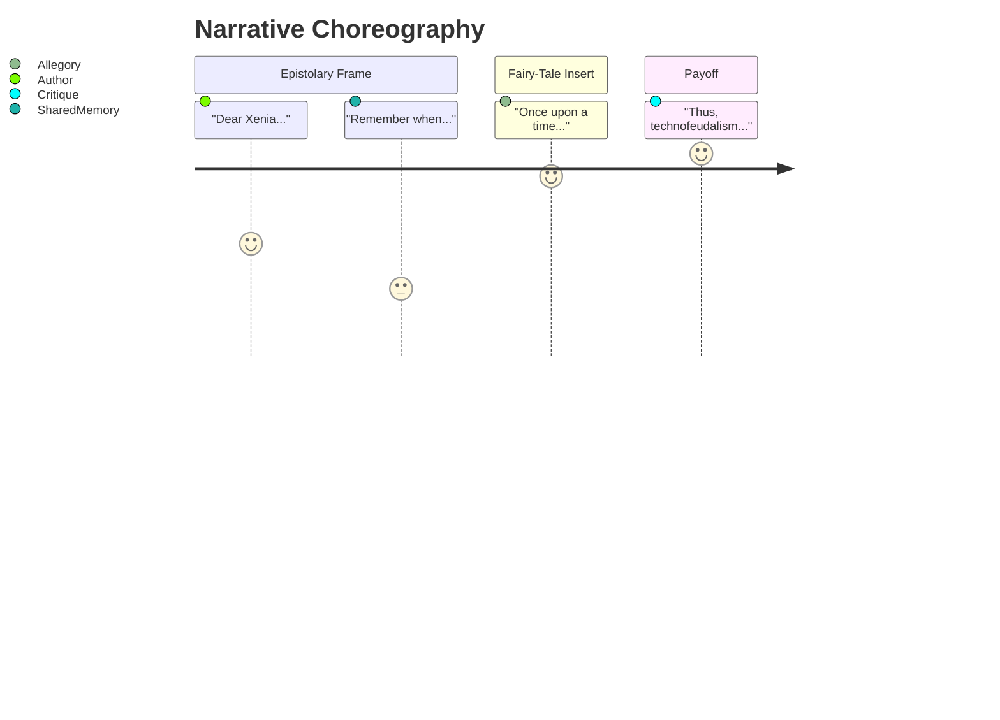

## 🔍 Summary / First Impressions  
> _Capture initial reactions, questions, emotional resonance._
- Dedicating this book to his dad indicates how deeply Varoufakis roots the theoretical in the personal.
- The father’s question about the internet’s role in capitalism becomes the text’s gravitational center.
- The subtitle doesn’t ask *if* capitalism is dead — it presumes the funeral already happened. That’s bold.

---
**Mermaid Narrative Architecture Diagram**  

**Key Interactions**:  
1. **Legitimation Loop** (Blue/Purple)  
   - The letter's personal tone ("Xenia...") *sanctifies* the allegory's exaggerations  
2. **Pedagogical Circuit** (Purple/Green)  
   - Fairy-tale → Emotional resonance → Cognitive breakthrough  

**Textual Evidence** (From *Technofeudalism* Ch.3):  
> *"Let me tell you a story you’d recite to a child... while cloud serfs hand over data-tributes to feudal lords in exchange for ‘free’ apps."*  

**Why This Works**:  
- The *implied wink* ("you’d recite to a child") acknowledges the allegory's artifice  
- The epistolary form *absorbs* potential criticism by framing it as conversational  

**Alternative Visualization**:  

---
Backlinks:  
- [[legitimation_loop]]  
- [[Technofeudalism]]  
- [[epistolary_form]]  
---

The diagrams reveal what text alone cannot—the *kinetics* of how form shapes ideological transmission.

## 🧠 Key Quotes & Marginalia  
> [!quote] Dedication  
> “For Dad who showed me how everything that matters is pregnant with its opposite.”

> [!quote] Preface  
> “Capitalism is not dying. It is already dead. What we have now is something else — a new feudal order cloaked in digital robes.”

> [!quote] Ch. 3
> "...an Antipodean nineteenth-century version of the Great Resignation." see [[19th_century_great_resignation]]

---

## 🧪 Conceptual Threads  
- Platform power displaces labor value — a move from wage slavery to data serfdom.  
- Surveillance is not a side effect — it’s structural.  
- Monetization of interaction becomes the new rent.

---

## ⚖️ Tensions & Contradictions  
- Frames capitalism as already dead, but uses capitalist terms (markets, rent, accumulation) throughout.  
- Speaks of platform kings, but what of the *users* as willing vassals?
- They once asked crystals to find the enemy. Now they ask code to _be_ the enemy. In the battlefield of tomorrow, the algorithm decides who disappears

---

## 🧭 ScorpyunStyle Reading Glyphs  
- His father = ancestral griot  
- Platforms = algorithmic lords  
- Surveillance = techno-chainmail  
- This ain’t Marx rebooted. This is *code theology* wrapped in Euro finance dialectic.
- “A griot’s reading is not just marginalia. It’s memory in ritual form.” -Algorithmic Griot

---

## 🜃 Connected Glyphs  
- [[session_context]]  
- [[digitalscorpyun_manifesto_and_syllabus]]  
- [[ai_fairness]]  
- [[technofeudal_bias_audit]]
## 🄃 Connected Glyphs

<%*
if (!tp.frontmatter || !Array.isArray(tp.frontmatter.linked_notes)) {
  tR += "⚠️ No linked_notes found in frontmatter.";
} else {
  for (let note of tp.frontmatter.linked_notes) {
    tR += `- [[${note.replace(/\.md$/, "")}]]
`;
  }
}
%>
